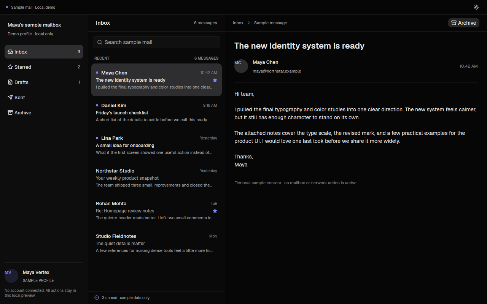

# MegaMail

A Linux-first native email client: a history-preserving [Hylki](https://github.com/hyprlab/hylki)
fork moving to [GPUI Kit](https://github.com/longbridge/gpui-kit), with the
visual language of [Zeron](https://github.com/zeronsh/zeron).

## Current state

The full Hylki tree and Git history are retained. The original GTK application
still lives at the root; the new GPUI Kit preview lives at `apps/megamail`.
The preview uses clearly labeled sample mail with working local search,
folders, message selection, archive/restore and light/dark themes. Geist is
bundled with its font license. It does not connect accounts or send email.

```sh
cargo run --manifest-path apps/megamail/Cargo.toml --locked
```

See [development setup](docs/MEGAMAIL_DEVELOPMENT.md) for Linux prerequisites
and verification commands. Running `cargo run` without the manifest path
still builds upstream Hylki, not the MegaMail preview.



[Light theme capture](docs/preview/light.png) · [Validation and limits](docs/MEGAMAIL_VALIDATION.md)

## Research and direction

[The research index](docs/research/README.md) brings together seven source-linked
reports and a portable visual atlas. The Zeron work covers its complete
surface/type/spacing/state language, hierarchy, materials, platform behavior
and rendering techniques—not only its palette.

- [Zeron design system](docs/research/zeron.md), [hierarchy](docs/research/zeron-hierarchy.md),
  [materials/rendering](docs/research/zeron-materials.md), and [visual atlas](docs/research/design-atlas.html).
- [Hylki extraction seams](docs/research/hylki.md), [GPUI Kit APIs](docs/research/gpui-kit.md),
  [performance/privacy audit](docs/research/performance-security.md), and
  [Thunderbird-style account onboarding](docs/research/account-onboarding.md).
- [Implementation architecture](docs/MEGAMAIL_ARCHITECTURE.md), [visual contract](DESIGN.md),
  and [product scope](PRODUCT.md).

Linux gets Zeron's opaque surface hierarchy, inset selection, compact chrome,
precise typography and restrained accents. Zeron's macOS compositor glass
and custom GPUI blur/edge-fade APIs are documented separately; they are not
assumed to transfer to the official Kit backend.

The next milestone is extracting Hylki's actual worker/cache/models into an
importable mail core, then connecting a read-only real-account slice. A
native shell does not establish mail feature parity. Performance figures in
the reports are proposed targets until measured against realistic mailboxes.

## Upstream and license

Forked from Hylki commit `43f2d4665f01a1f0ef4474d719179b8e5b61471c`.
The preserved [upstream README](docs/HYLKI_UPSTREAM_README.md) and Hylki docs
explain the original application; its packaging/workflows still refer to Hylki.

MegaMail retains Hylki's **AGPL-3.0-or-later** license. See [LICENSE](LICENSE),
[upstream asset licenses](docs/LICENSE.md) and [third-party notices](THIRD_PARTY_NOTICES.md)
for Zeron MIT and Geist SIL OFL attribution. GPUI Kit and its bundled assets
retain their respective licenses.
